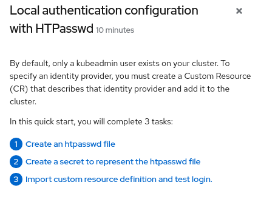
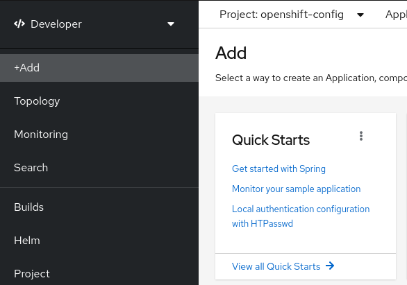

# OpenShift Quickstarts

Centralized repository of community Quickstarts that anyone can import into their OpenShift deployments. Quickstarts have been added as a custom resource definition in OpenShift so that administrators can easily add instructions for end users to have best practices for OpenShift without having to open another tool to find the best practice. 

## Objective

With the addition of [Quick starts to OpenShift](https://docs.openshift.com/container-platform/4.7/web_console/creating-quick-start-tutorials.html) we want to curate a place for people to create and contribute quick starts to use for their deployments that may not be included in an operator. Here is a image of an example Quickstart we created for creating users in the console via a HTPasswd file:



## OCP QuickStart Ideas

Please add to the list here of quickstarts that would be helpful.

| Quickstart                   | Details                                                       |
|------------------------------|---------------------------------------------------------------|
| Authentication via HTPasswd  | oc create authentication_configuration/htpasswd_auth.yaml     |
| Authentication Configuration | How to Configure oauth ldap etc                               |
| OCP-Virt port mapping        | How to open SSH or RDP to a vm)                               |
| Alert customizations         | editing alert bodies, customize or create new alerts          |
| MTV (Konveyor)               | How to: Move vms from vmware, Move vms across storage devices |
| OCP-Virt Connect to BMC      | (Bare Metal Controller ie. iLO, Drac, etc)                    |
| Create storage class         | How to create a storage class                                 |
| Secrets and use cases        |                                                               |

Please do a pull request to the repository or put in an issue and we will add to the list.

## Quick Starts

| Quickstart                  | To install clone this repository and run the below command   |
|-----------------------------|--------------------------------------------------------------|
| Authentication via HTPasswd | oc create -f authentication_configuration/htpasswd_auth.yaml |

## Quick Example on how to create a Quick Start

### Prerequisites

You must have cluster administrator privileges.

### Procedure

To create a new quick start, run:

```shell
oc get -o yaml consolequickstart spring-with-s2i > my-quick-start.yaml
```

Run:

```shell
oc create -f my-quick-start.yaml
```

Update the YAML file using the guidance outlined in [this documentation](https://docs.openshift.com/container-platform/4.7/web_console/creating-quick-start-tutorials.html).

Save your edits.

To quickly test the quickstart choose the openshift project `openshift-config` go into developer on and click the `+Add` button in the left menu. You should see quickstarts in the top left box. See image below:



### Example QuickStart for HTPasswd

We created a QuickStart to show you how to add users using HTPasswd as an example in the authentication_configuration folder. 

Apply to cluster:

```shell
oc create -f authentication_configuration/htpasswd_auth.yaml
```

If you dont want to have to download the git repository you can also do it directly from the web like this:

```shell
oc create -f https://raw.githubusercontent.com/redhat-adsa/OpenShift-Quickstarts/main/authentication_configuration/htpasswd_auth.yaml
```

### Tips

For testing you will need to delete and apply the CRD and reapply it:

```shell
oc delete consolequickstarts htpasswd-auth -n <namespace>
```

Re-apply:

```shell
oc create -f my-quick-start.yaml
```

To get a list of all quickstarts:

```shell
oc get consolequickstarts
```
